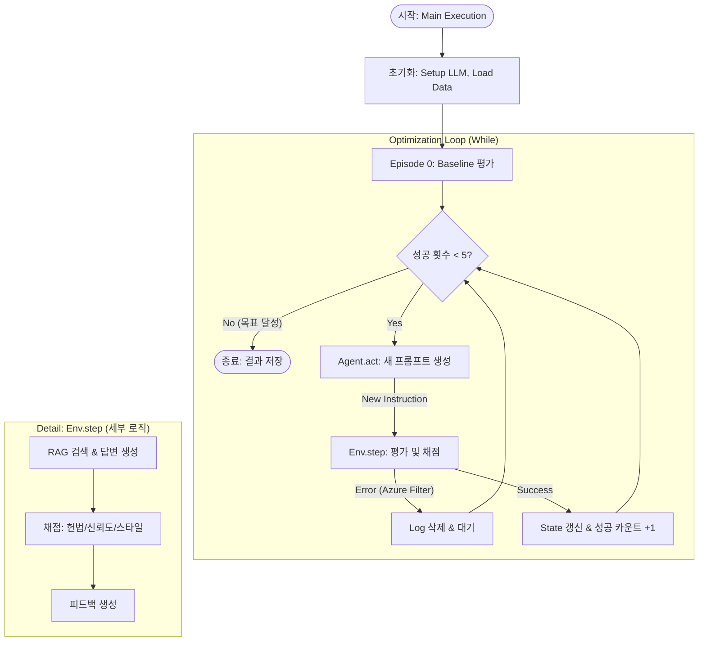

# Prompt Optimization (프롬프트 최적화)

이 프로젝트는 LLM을 사용하여 RAG 시스템의 프롬프트를 자동으로 최적화하는 강화학습 에이전트입니다.  
##### Release Tag v1.0
State-Action-Reward 강화학습을 모티브로 설계한 프롬프트 최적화 프레임워크,  Google generative ai (gemini) 를 사용하였습니다.  

##### 진행 중
최근에 나온 다양한 프롬프트 최적화 도구를 사용해, 디벨롭해보고자 합니다.    
In-Context RL (맥락 기반 강화학습)   

---

---

# Reinforce Project

## Dependencies & Acknowledgments

This project uses code from the following open source projects:

### DSPy
- **Source**: [Stanford DSPy](https://github.com/stanfordnlp/dspy)  
- **License**: MIT License  
- **Usage**: Bootstrap algorithm implementation study (`utils/tools/dspy_ai/study/`)
- **Copyright**: Copyright (c) 2023 Stanford Future Data Systems

---

## 환경 설정 가이드 (Installation)

자세한 설치 및 환경설정 방법은 [Setup Guide](docs/setup_guide.md)를 참고하세요.
